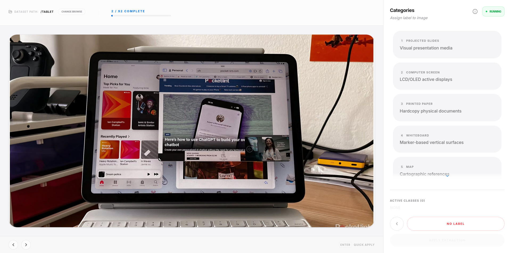
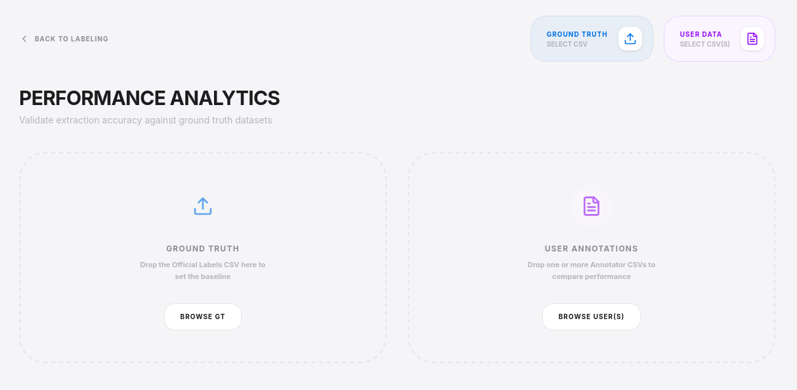
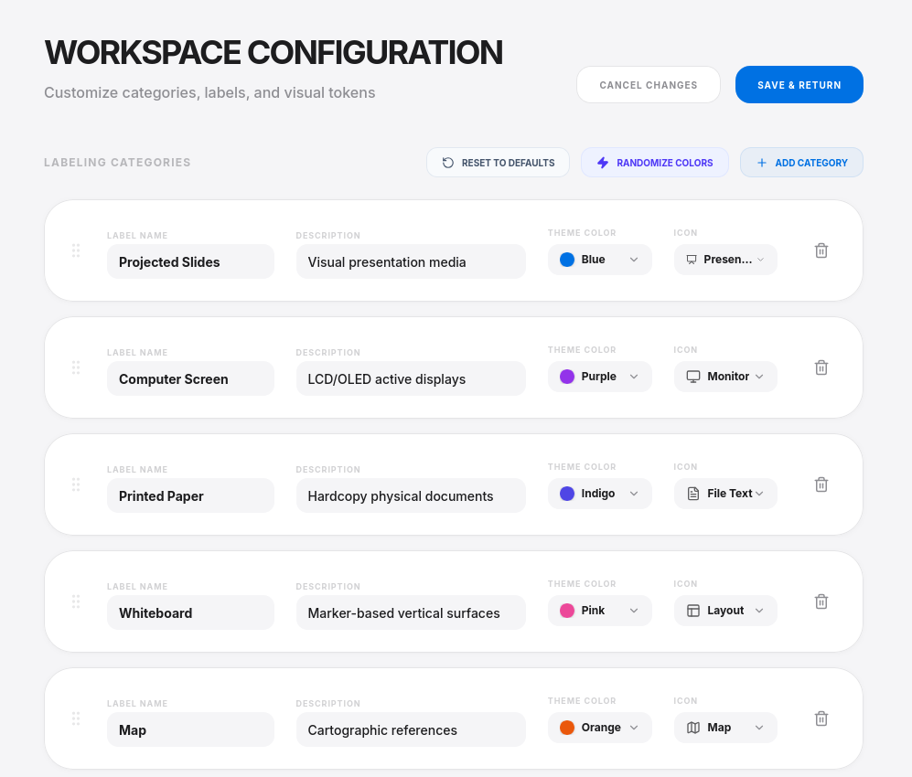
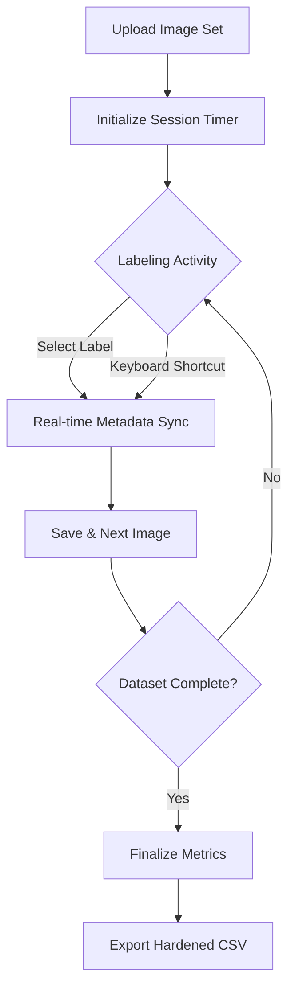
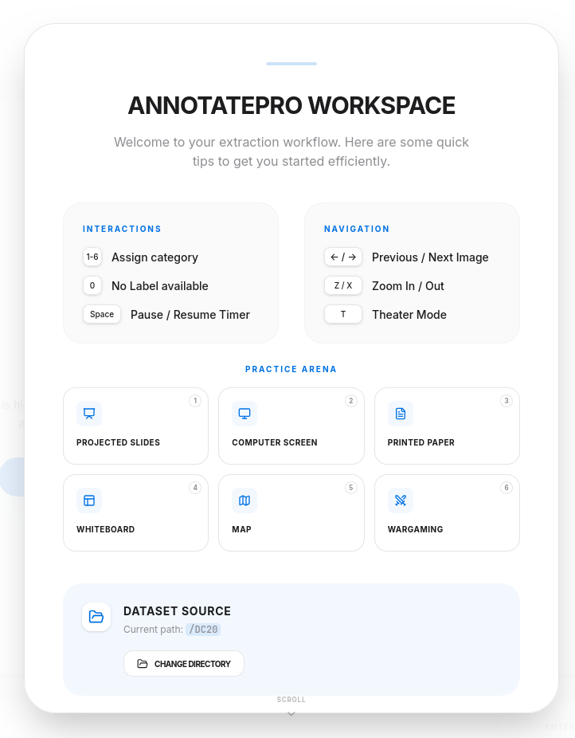
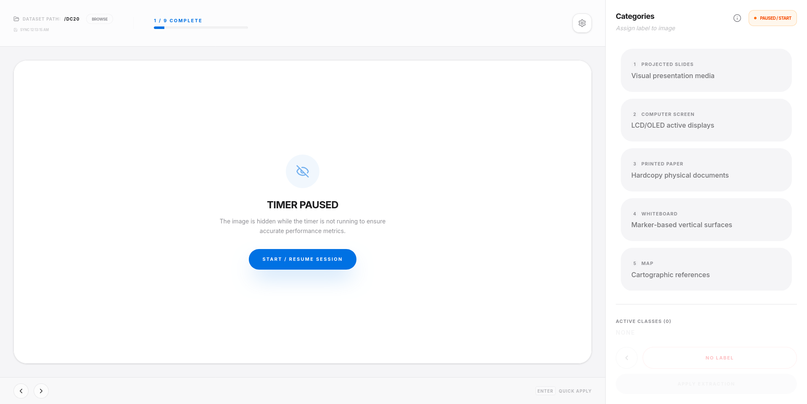
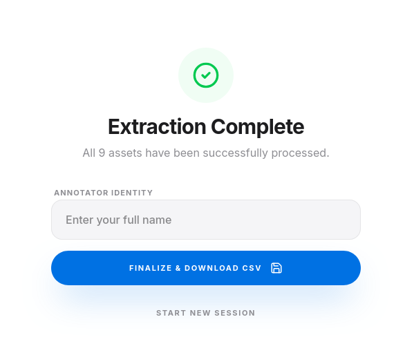

# 🏷️ AnnotatePro: Precision Labeling Workspace

[](https://opensource.org/licenses/Apache-2.0)
[](https://react.dev)
[](https://tailwindcss.com)
[](https://vitejs.dev)



> **Precision Labeling for High-Performance Datasets.**
> AnnotatePro is a professional-grade workspace designed for high-throughput data extraction and labeling. While the interface is optimized for specific technical categories by default, the labeling schema is fully flexible and can be adapted to any domain—including digital displays, or physical documents.

---

## 📸 Interface Preview

### 1. The Workspace
| Component | Description |
| :--- | :--- |
| **Central Canvas** | High-resolution image preview with Precision View Engine (8x zoom) and integrated overlay controls. |
| **Action Sidebar** | The primary control hub containing category toggles, the active session timer, and the "Apply Extraction" matrix. |
| **Intelligence Header** | Real-time performance dashboard tracking labels/min, dataset path status, and global workspace toggles. |
| **Navigation Anchor** | Minimalist footer for dataset traversal with visual indicators for keyboard shortcut status. |

---

## ✨ Key Features

### 🚀 High-Efficiency Workflow
- **Precision View Engine**: Seamless zooming and panning using `react-zoom-pan-pinch`.
- **Theater & Fullscreen Modes**: Maximize focus by stripping away UI chrome for concentrated labeling sessions.
- **Auto-Save Resilience**: Background persistence every 30 seconds ensures no data is lost during sessions.
- **Keyboard Shortcuts**: Native-feel navigation (Next image via quick-apply logic).

### 🏷️ Customizable Labeling System
AnnotatePro allows you to define a tailored extraction schema. By default, the system includes categories for:
- 📽️ **Projected Slides**: Visual presentation media
- 🖥️ **Computer Screen**: LCD/OLED active displays
- 🗺️ **Map**: Cartographic references
- 📝 **Whiteboard**: Marker-based surfaces
- 📄 **Printed Paper**: Hardcopy physical documents

The labeling interface is fully extensible via the **Workspace Settings**, allowing you to add, remove, or modify categories to fit your specific data needs.

### 📊 Data Integrity & Export
- **CSV Engine**: Generates unique, timestamped extraction logs.
- **Detailed Logging**: Records node source, label confidence, session duration, and unique identifiers.
- **Timestamp Precision**: Prevents file naming collisions with ISO-standard safe strings.

### 📊 Insight & Analytics

- **Intelligence Dashboard**: Real-time visualization of labeling performance, category distribution, and time-per-image metrics.
- **Expanded Workspace**: Optimized analytics layout (6xl width) providing maximum screen real estate for deep data inspection.
- **Efficiency Feedback**: Instant calculation of labeling throughput (labels per minute) and dataset coverage.

### 🖱️ Drag-and-Drop Workflow
AnnotatePro prioritizes speed with modern interaction patterns:
- **Intuitive Dashboard**: The main interface now explicitly guides users to drag and drop files directly into the workspace for instant session initialization.
- **Instant Upload**: Drag images or CSV ground truth files anywhere on the screen to begin labeling immediately.
- **Reorderable Schema**: In Workspace Settings, drag category tiles to reorder them, which automatically updates the 1-N keyboard mappings.
- **Visual Feedback**: Professional-grade drop-zone overlays ensure a clear mental model of data ingestion.

### 🎭 Elegant View Transitions
The workspace utilizes advanced motion design to provide a seamless context-switching experience:
- **Non-Linear Navigation**: Switching between Metrics, Settings, and the Labeling Canvas uses staggered scale-and-fade animations that maintain user orientation.
- **Frictionless Feedback**: Interactive elements provide subtle weight-shifting and hover transitions to make high-volume sessions feel tactile and responsive.

### ⚙️ Label Modifications

The Workspace Configuration menu allows for rapid adaptation of the labeling environment:
- **Dynamic Categories**: Add new labels or remove obsolete ones on the fly.
- **Visual Tokens**: Customize theme colors and icons for each category to improve cognitive recognition during high-speed labeling.
- **Persistent Logic**: Settings are backed up to local storage, ensuring your configuration persists across sessions.

### 🔄 Label Generation Flow
How AnnotatePro generates labels and exports data:



### ⏱️ Timing & Performance Metrics
AnnotatePro tracks high-fidelity timing data for every image to analyze labeling throughput and difficulty:
- **StartTime**: The ISO-8601 timestamp when the image first became the focus of the session.
- **EndTime**: The timestamp when the "Save & Next" action was triggered for that specific image.
- **DurationSeconds**: The precise elapsed time spent labeling the image, accounting for pauses, tutorial views, and session interruptions.

---

## 🏗️ Interface Components

### 🎓 Integrated Tutorial


An interactive onboarding system that pauses the session timer to ensure users understand the keyboard shortcuts and workflow without penalizing their performance metrics.

### 🖊️ Labeling Screen


The primary workspace featuring the Precision View Engine. It provides immediate visual feedback for selected labels and real-time session stats.

### 🏁 Session Completion


The final stage of the labeling workflow where users can review aggregate metrics, inspect their performance (labels/min), and download the finalized dataset.

---

## ⌨️ Keyboard Shortcuts
Maximize efficiency with dedicated keyboard mappings:
- `1-6`: Toggle corresponding label categories
- `0`: Mark as **No Label** and proceed
- `Enter`: **Apply Extraction** and move to next node
- `Space`: Toggle **Timer** (Start/Pause)
- `Arrow Left/Right`: Navigate through dataset
- `Shift + A`: Toggle **Analytics Dashboard**
- `T`: Toggle **Theater Mode** (Zero-UI inspection)
- `Z / X`: Zoom In / Out

---

## 🛠️ Technical Architecture

### Core Stack
- **Frontend**: React 18 (Functional Component Architecture)
- **Styling**: Tailwind CSS 4.0 (Design Tokens & Utility-First)
- **Animation**: Framer Motion (State-driven transitions)
- **Data Visualization**: Recharts (High-performance charting)
- **Icons**: Lucide React (Pixel-perfect vector set)

### System Requirements
- **Node.js**: v18.0.0 or higher
- **Modern Browser**: Chrome, Firefox, Safari, or Edge (for Canvas/Grid support)

---

## 📥 Getting Started

1.  **Clone & Install**
    ```bash
    npm install
    ```

2.  **Launch Workspace**
    ```bash
    npm run dev
    ```

3.  **Operation**
    - Click **"Got it, Let's Begin"** in the tutorial.
    - Revisit instructions anytime via the **Integrated Tutorial (i)** icon in the header.
    - Set your **Dataset Path**.
    - Select labels for each image and click **"Save & Next"**.
    - Click **"Finish & Export"** when the session is complete.

---

## 📋 Changelog (Recent Updates)

- **Elegant Layout Transitions**: Completely overhauled the transition logic between Workspace, Settings, and Metrics for a smoother, high-end feel.
- **Drag & Drop Visibility**: Added explicit on-screen instructions for Drag & Drop support to improve accessibility for new users.
- **Refined Action Sidebar**: Optimized the sidebar with a cleaner visual hierarchy and improved scrolling performance.
- **Integrated Tutorial System**: Added a persistent 'i' icon in the header for anytime-access to onboarding instructions.
- **Smart Timer Management**: The session timer now automatically pauses when the tutorial is open and resumes when closed, ensuring timing accuracy.
- **Expanded Analytics View**: Removed sidebars in the analytics view to provide a 50% increase in usable space for data visualization.
- **Dataset Feedback**: Enhanced the timer interface with a 'Disconnected' state and clear UX indicators when no image dataset is linked.
- **Precision View Engine**: Smooth 8x zoom/pan integration for high-detail labeling tasks.
- **Theater Mode**: Implemented a distraction-free viewing toggle for precision inspection.

---

*Built with ♥️ by the AnnotatePro Team.*
